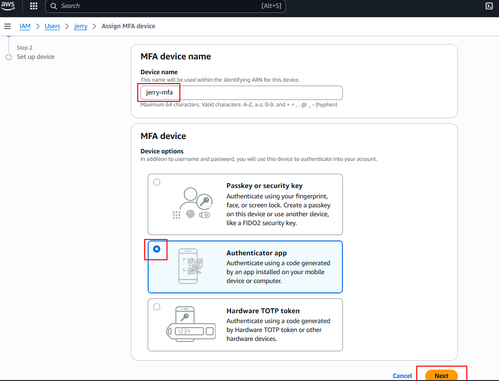

# aws-iam-users
## Setting up IAM Users on AWS
This project will walk you through setting up IAM, creating a secure environment that reflects real-world usage and challenges while learning the fundamentals of IAM, how to manage access to AWS resources, and best practices for securing your cloud environment.

## IAM Users
An IAM User is a unique identity within an AWS account that represents a person or service, granting specific permissions to access and interact with AWS resources under controlled and customizable security policies. These users only have access to specific AWS resources based on their job description.

For this project, we will be setting up two IAM users for a backend developer, Jerry, and a data analyst, Moses, by first determining their specific access needs.

- As a backend developer, Jerry requires access to Servers (EC2) to run his code, necessitating the need to have policies granting EC2 access.  
- As a data analyst, Moses needs access to data storage (AWS S3 Service), so he needs policies enabling S3 access.

Let's assume that Jerry and Moses work with a startup **"Zappy e-Bank"** which provides financial services. The bank is planning on expanding the developer team with 10 more developers and the analyst team with 5 more analysts. It would be inefficient to individually create similar policies for each new member. A more streamlined approach involves:

1. Crafting a single policy tailored to each role's access requirements.  
2. Associating this policy with a group specifically designed for that role.  
3. Adding all developers or analysts to their respective groups, simplifying the management of permissions and ensuring consistent access across the team.

Before we create the actual users, let us begin by creating the policies and user groups.
   
## Creating Policy for the Development Team
1. Log into the AWS Management console with your root user email address and password.  
   Click on the search bar at the top left and type in **IAM**, select it to go into the IAM Console, then click on **Policies** from the left pane.  

   

2. Click on **Create policy** from the top right corner.  

3. Search for **EC2** in the "Select a Service" section.  

   

4. For simplicity, select the **All EC2 actions** checkbox.  

   

   Also make sure to select **All** in the "Resources" section and click **Next**.  

   

5. Enter the policy name **developers** and provide a description. Then click **Create policy** at the bottom right corner of the page.  

   

After creating the policy, type **developers** in the search bar and notice that multiple policies are returned. This highlights the presence of both **AWS managed** and **customer managed** policies.  

- AWS managed policies are predefined by AWS and provide permissions for many common use cases, allowing for quick and broad access management across AWS services.  
- Customer managed policies are created and fully controlled by the customer, allowing for more tailored, specific access controls that can be fine-tuned to the organization's requirements.  

   

## Creating Policy for the Data Analyst Team
Repeat the same process above to create a policy for the data analyst team. Instead of selecting EC2, search for **S3 (Simple Storage Service)**. Name the policy **analyst** and provide an appropriate description.

## Creating a Group for the Developers Team
From the IAM Management console, select **User groups** on the left pane and click **Create group** at the top right corner.  

Provide a name for the group and attach the **developers** policy created earlier, then click **Create group**.  

Now you have successfully created a group with attached permissions for users to access EC2 resources.

## Creating a Group for the Analyst Team
Repeat the same process for the analyst group.  
The group name should be **Analyst-Team**, and attach the **analyst** policy so users in this group will have access to S3 services.

## Creating IAM User Jerry
Let us create an IAM user and add it to a group.  

From the IAM Management console, click **Users** on the left pane, then click **Create User**.  

Enter the username **jerry** and check **Provide user access to the AWS Management console - optional**. This enables the user to log in from a browser.  

Select **IAM user** creation, then choose **Autogenerate password** for a one-time password. Check **Users must create a new password at next sign-in - Recommended**.  

Click **Next**.  

Select **Add user to group**, then check the **development-team** group, and click **Next**.  

Review the details and click on **Create user**.  

Download the login credentials for Jerry.  

## Creating IAM User Moses
Repeat the same steps for Moses, but assign him to the **Analyst-Team** group.

## Testing and Validation
- Log in as Jerry: Use the credentials you downloaded earlier.  
- Enter **jerry** as the username and the password provided, then sign in.  

On the password reset page, enter the old password provided, type in a new one, and confirm it.  

Click **Continue to sign in**.  

Notice on Jerry's page that non-EC2-related resource access is denied, but EC2 resources are accessible.  

Click **EC2** on the console.  

Click **Launch instance**.  

He can fill in details and launch the instance, confirming his EC2 access.  
Run the same test for Moses to confirm his S3 permissions.

## Multi-Factor Authentication (MFA)
Multi-Factor Authentication is a security feature that adds an extra layer of protection to your AWS account and resources. With MFA enabled, users must provide two or more forms of authentication before accessing AWS resources.

### Setting Up MFA for Jerry
1. Sign in as a root user and go to the IAM Management Console.  
2. From the left pane, click **Users** and select **jerry**.  

3. In the "Console access" section, click **Enabled without MFA** → **Enable MFA**.  

4. Fill in the MFA device name. Select the device option (Authenticator app), then click **Next**.  

5. Use Google Authenticator. Click **Show QR Code**, scan with the app, and enter two consecutive 6-digit codes to verify.  

6. Once successful, the page should display **MFA device assigned**.  

### Setting Up MFA for Moses
Repeat the same process for Moses.

---

# Project Reflection

### 1. Explain the Role of IAM in AWS
IAM (Identity and Access Management) in AWS provides centralized control over who can access which AWS resources and what actions they can perform. It ensures secure access management by assigning specific permissions to users, groups, or services. This helps protect sensitive data, enforces organizational policies, and improves efficiency by avoiding unnecessary manual control over individual resources.

### 2. Differentiate Between IAM Users and Groups
- **IAM Users** are individual identities with specific credentials (username, password, access keys). You would create an IAM user when you need to grant unique access to a single individual or service—for example, Jerry (a backend developer) who requires EC2 access.  
- **IAM Groups** are collections of users who share the same access needs. Instead of assigning permissions to each user individually, you attach policies to the group. For instance, a group for all developers with EC2 permissions simplifies management and ensures consistent access levels.

### 3. Describe the Process of Creating IAM Policies
To create a custom IAM policy:
1. Navigate to the IAM console and select **Policies**.  
2. Click **Create policy**.  
3. Select the AWS service (e.g., EC2, S3).  
4. Define actions (e.g., "All EC2 actions").  
5. Specify the resources (e.g., all instances or specific buckets).  
6. Name and describe the policy.  
7. Attach the policy to a group or user.  
This ensures that the right role receives the right permissions.

### 4. Explain the Significance of the Principle of Least Privilege
The principle of least privilege means granting users only the permissions they need to perform their tasks—nothing more. In AWS IAM, this minimizes the attack surface and prevents accidental or malicious misuse of resources. For example, Jerry only has EC2 access and cannot access S3, while Moses only has S3 access, aligning perfectly with this principle.

### 5. Reflect on the Scenario with Jerry and Moses
- **Jerry (Backend Developer)**: Assigned to the **development-team group** with the **developers policy**, giving him EC2 access only.  
- **Moses (Data Analyst)**: Assigned to the **Analyst-Team group** with the **analyst policy**, granting him S3 access only.  
These configurations align with their job functions by restricting Jerry to compute resources and Moses to storage resources. The use of groups and policies ensures scalability for future hires and enforces the principle of least privilege by limiting each user to only what is required for their role.

---

## Conclusion
By following this project, we successfully created a secure IAM environment tailored to real-world usage. We:  
- Designed and applied role-based policies for developers and analysts.  
- Created user groups to simplify permission management.  
- Added IAM users Jerry and Moses, granting them least-privilege access.  
- Implemented MFA for stronger security.  

This structured approach not only enhances security but also ensures scalability as the organization grows. With policies and groups in place, onboarding new team members becomes straightforward, consistent, and secure.
